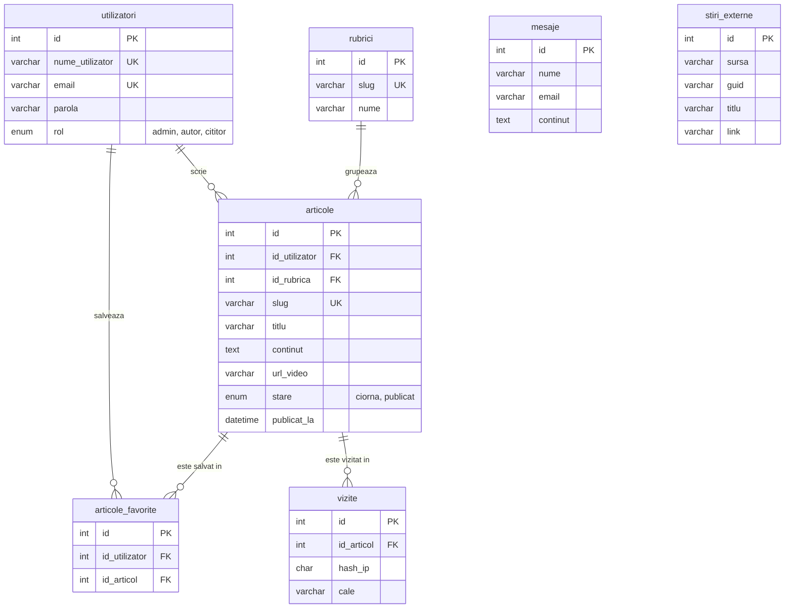

# Revistă Online

Proiect pentru cursul **Dezvoltarea Aplicațiilor Web** (DAW), FMI UniBuc.

*Student: Lucian Boca - Informatică ID, anul II, grupa 2*

Autorii scriu articole, administratorul le publică, cititorii
înregistrați își salvează articolele favorite, iar administratorul urmărește
statisticile de trafic.

**Aplicația rulează la <https://revista-online-daw.meronym.tech>**

## Conturi de test

Toate au parola `parola123`.

| Utilizator | Email | Rol |
|---|---|---|
| admin | `admin@revista.test` | administrator |
| ioana | `ioana@revista.test` | autor |
| radu | `radu@revista.test` | autor |
| cititor | `cititor@revista.test` | cititor |

## Roluri

| Rol | Ce poate face |
|---|---|
| **Vizitator** | Citește articolele publicate, navighează pe rubrici, descarcă PDF-ul unui articol, scrie redacției, își face cont |
| **Cititor** | Tot ce poate un vizitator, plus salvarea articolelor la favorite |
| **Autor** | Scrie și editează propriile articole și exportă CSV cu ele; nu vede și nu modifică articolele altui autor |
| **Administrator** | Publică, editează și șterge orice articol, vede statisticile, exportă CSV cu tot |

Un articol trece prin două stări: autorul îl scrie și îl lasă în stadiul de **ciorna**,
administratorul îl marchează ca **publicat**. Până atunci nu este vizibil public,
chiar dacă cineva îi ghicește adresa.

## Arhitectură

PHP 8.3 și MySQL 8.4, fără framework și fără CMS. Caddy ca server web, Docker
Compose pentru mediul de dezvoltare. FPDF și PHPMailer sunt incluse direct în
proiect. Bootstrap pentru UI.

Fișierul `public/index.php` este intrarea unică și definește rutarea cererilor:

```
cerere → bootstrap.php: sesiune, handler de erori, încărcarea modulelor
       → token CSRF, verificat o dată pentru orice POST
       → switch pe rută: verifică drepturile, apoi acțiunea
       → render() → șablonul paginii în views/layout.php
```

Codul are trei locații principale și nu folosește clase: logica în `src/`, câte un
fișier pe arie de responsabilitate (`auth`, `articles`, `admin`, `analytics`, `contact`,
`news`, `reports`), șabloanele în `views/`, iar structura și datele de test în `db/`.

- **Baza de date este accesată generic:** `find()`, `findAll()`, `insert()`,
  `update()` și `delete()` merg pe orice tabel din lista permisă în `src/db.php`.
  Interogările cu join sunt scrise manual unde e nevoie de ele.

- **Verificările sunt implementate într-un singur loc:** token-ul CSRF în front controller,
  pentru toate cererile POST; drepturile la începutul rutei, cu `requireRole()`
  pentru rol și `requireOwnerOrAdmin()` pentru autor.

- **Același layout pentru toate paginile:** `views/layout.php`.

- **Configurarea e preluată din mediu:** Parolele, cheile și adresele sunt citite cu
  `getenv()` din `.env` (care nu ajunge în git).

## Baza de date



## Instalare locală

```
make setup   # creează .env din .env.example
make up      # pornește stack-ul (Caddy + PHP-FPM + MySQL + phpMyAdmin)
make db      # reface baza de date de la zero: structură + date de test
make down    # oprește stack-ul
make help    # restul comenzilor
```

| Serviciu | Adresă |
|---|---|
| Aplicație | http://localhost:8080 |
| phpMyAdmin | http://localhost:8081 |
